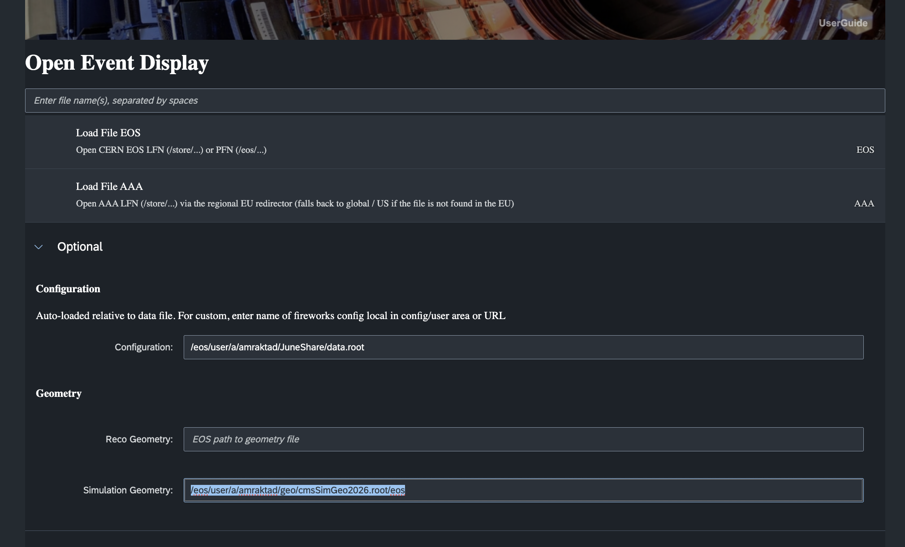
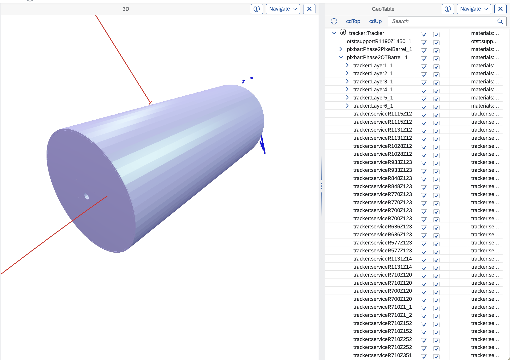
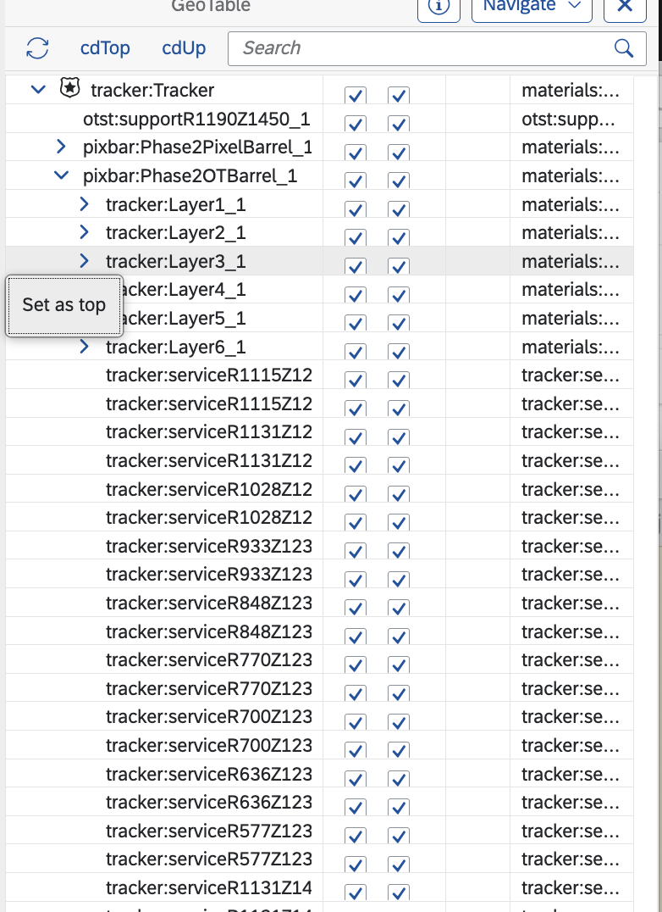
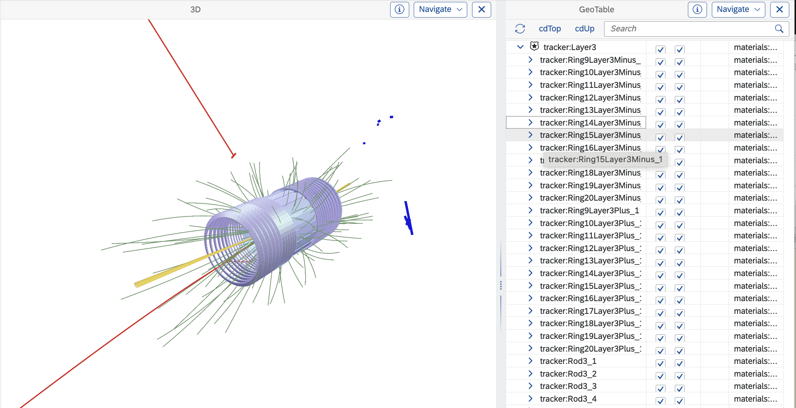
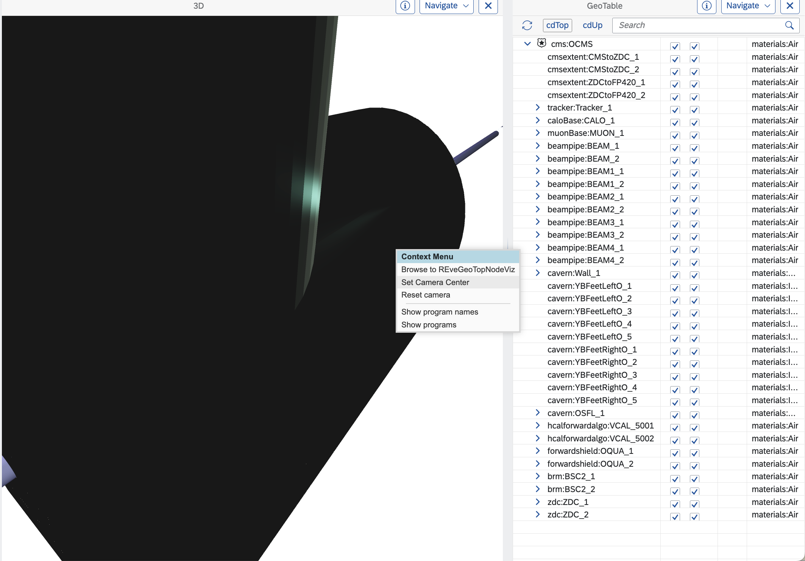
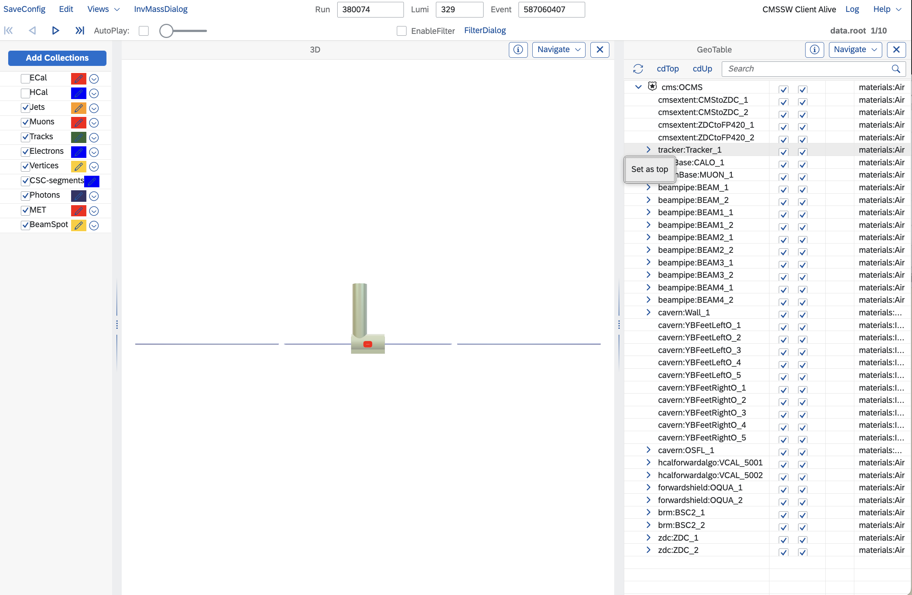

## Current Status


### Existing Functionality
* Able to se set top node
* Able to rnrSelf and RnrChjildren

### Issues
* Outline does not clear in some cases

### Upcoming Features
* Missing clipping plane control
* Implementation ov overlap/extrusion view

## FireworksWeb gateway
The path to simulation file is specified in the optional input entry.'

Some of the available examples are :
```
/eos/user/a/amraktad/geo/cmsSimGeo2021.root
/eos/user/a/amraktad/geo/cmsSimGeo2026.root
/eos/user/a/amraktad/geo/cmsSimGeom-14.root
/eos/user/a/amraktad/geo/cmsSimGeomRun1.root
/eos/user/a/amraktad/geo/cmsSimGeomRun2.root
/eos/user/a/amraktad/geo/cmsSimGeomSLHC.root
```


## Moving down in hierarchy
The geometry sets tracker geometry as top node.
Use 'Set As Top'  popup menu item to move down in the hierarchy




Right mouse click makes acess to thepopup menu in geometry table:



### New top node path



## Move up in the hierarchy
Useb'cdTop' or 'cdUp' button in the geometry table to move up.

 Screenshot when geo browser top node  is set to TGeoManager top node:


In cases where bounding box span changes dramatically, one needs to reset camera to have a proper camera view and lighting



