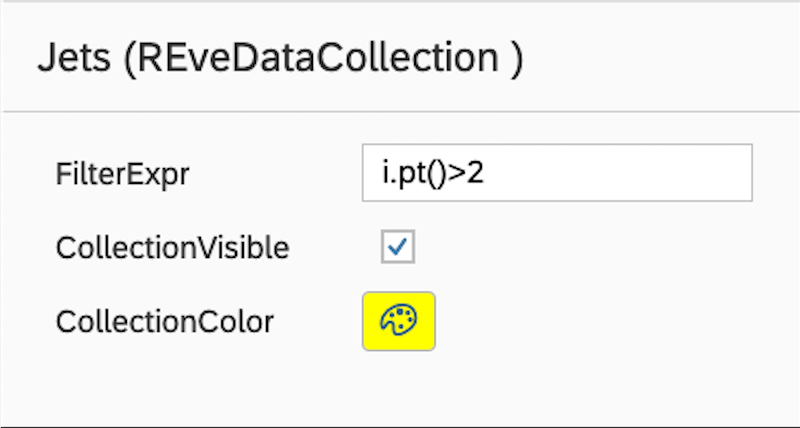
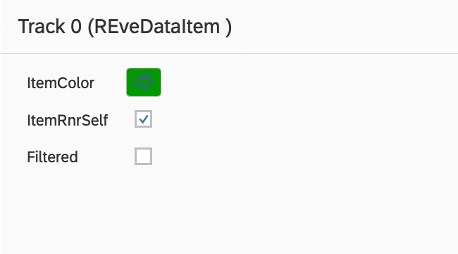

# User Guide

## Table of Contents
1. [Collections](#collections)
    1. [Collection Controller](#collection-controller)
    2. [Object Controller](#example3)
    2. [Add Collection Dialgo](#example3)
3. [Table View](#table-view)
4. [Event Filter](#fourth-examplehttpwwwfourthexamplecom)

---

## Collections
### Collection Controller:

Editing Physics Collection filters and display properties
The collection dialog can be accessed by clicking the *edit* button on the list-tree browser entry corresponding to the desired collection.



### Physics Object / Item Dialog

Items in the collection can be edited as well. For the moment it is possible to manually set color, visibility, and examine the collection filter status for this item.




### Add Collection Dialog 
Selecting and adding new physics collections
Like in the [original Fireworks](https://twiki.cern.ch/twiki/bin/view/CMSPublic/WorkBookFireworks) original Fireworks, it is possible to select EDM collections and to add them into graphical or table views. The dialog contains general search filed on the top that matches text anywhere in the table (module label, type, process name, or visualization purpose). Sorting on any column can be activated by clicking on the column heading.


## Table view

In the table view any loaded physics collection can be chosen from the drop-down menu in the table view header. The edit button gives access to a dialog for adding a new table column. The column expression entry has a tab-complete functionality that lists public member function for the physics item class. At the moment, the list does not contain functions from the base-classfrom baseclasses.  Note, just like in the collection controller, the physics item that is to be evaluated is passed into the expression as variable 'i' and functions can be accessed by the 'i.functionName()' syntax.


## Event Filter
Event filtering window is activated by the button below Run/Lumi/Event entries (see control layout)
Event filtering is a powerful tool for selecting interesting events based on a complex selection anything that you can use as selection in a Draw command in FWLite/Root will work. You may also filter on HLT triggers. When event-filtering is enabled, all event navigation is restricted to events that passed the selection.

Each filter expression is interpreted by Root's TTree::Draw(), and only events for which the expression is true are displayed. For convenience, collections can also be referred to by their Fireworks names (the names displayed in the summary view) rather than their FWLite names which tend to be rather arcane.

### Examples:

```$Electrons.pt() > 10``` Select events where there is at least one electron in the Electrons collection ("gsfElectrons" by default) with pT at least 10GeV.

```$Jets[0].pt()>50 && $Jets[1].pt()>20``` Request the leading jet in the Jets collection to have at least 50GeV and the second leading jet to have at least 20GeV.
Note: Not all collections are sorted, for example, Muons are not!

```$Muons@.size() == 4``` Request 4 muons.

```L1-Muon.@obj.size()>0``` Will require at least one L1 Muon in the event. One can obviously couple this with additional requirements on its Pt, for example.

```$HCal.obj.hadEnergy() > 3``` add .obj in expression because CaloTower is a collection of collection. Tou may look the structure in TBrowser.

s
