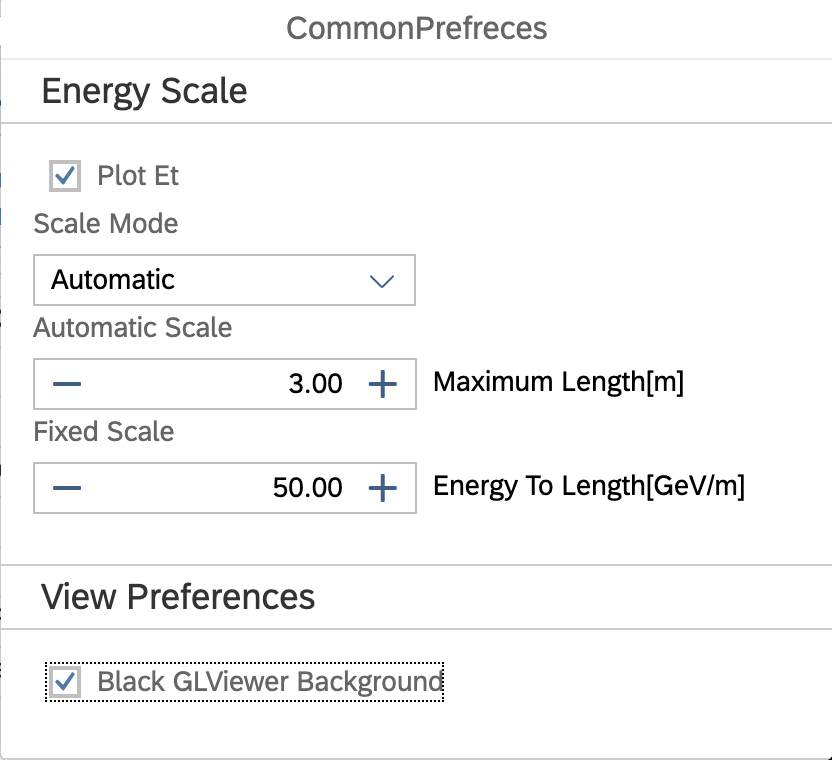

# User Guide

## Table of Contents
1. [Data File Access](#data)
1. [Collections](#collections)
    1. [Collection Controller](#collection-controller)
    2. [Item Controller](#item-controller)
    2. [Add Collection Dialog](#add-collection-controller)
3. [Table View](#table-view)
4. [Event Filter](#event-filter)
4. [Common Preferences](#common-preferences)
    1. [Energy Scale](#energy-scale)
    1. [Colors](#colors)
5. [Advanced Options](#advanced-options)

---

## Data File Access

## EOS acess at CERN service site ([fireworks.cern.ch](https://fireworks.cern.ch))

### CMS public data
CERN service can access any CMS public file on path /eos/cms/store/.

### User data at CERNBox

Data at CERNBox area must be shared with ```cms-vis-access``` egroup to be visible to web service. Steps are explaind more in the detail in [UserShare.md](UserShare.md)


Below is an example of directory ```/eos/user/a/amraktad/Fireworks-Test/``` shared for the event display service.


<!--
### Xrootd acess at UCDS site ([fireworks.ucsd.edu](https://fireworks.ucsd.edu))
UCSD can only access data through xrootd.The UCSD members can put their files on hadoop system. E.g. ```/hadoop/cms/store/user/tester/demo.root``` which will translate to LFN ```/store/user/tester/demo.root```.
-->

## Collections
Collection controlls are accessible in the left most part of the browser window.

### Collection Controller

Editing Physics Collection filters and display properties
The collection dialog can be accessed by clicking the *edit* button on the list-tree browser entry corresponding to the desired collection.


### Item Controller

Items in the collection can be edited as well. For the moment it is possible to manually set color, visibility, and examine the collection filter status for this item.


### Add Collection Dialog 
Selecting and adding new physics collections
Like in the [original Fireworks](https://twiki.cern.ch/twiki/bin/view/CMSPublic/WorkBookFireworks) original Fireworks, it is possible to select EDM collections and to add them into graphical or table views. The dialog contains general search filed on the top that matches text anywhere in the table (module label, type, process name, or visualization purpose). Sorting on any column can be activated by clicking on the column heading.


## Table view

In the table view any loaded physics collection can be chosen from the drop-down menu in the table view header. </p>
The edit button gives access to a dialog for adding a new table column. The column expression entry has a tab-complete functionality that lists public member function for the physics item class. At the moment, the list does not contain functions from the base-classfrom baseclasses.  Note, just like in the collection controller, the physics item that is to be evaluated is passed into the expression as variable 'i' and functions can be accessed by the ```i.functionName()``` syntax.


Event filtering window is activated by the 'Filter Dialog' button below Run/Lumi/Event entries.


Event filtering is a powerful tool for selecting interesting events based on a complex selection anything that you can use as selection in a Draw command in FWLite/Root will work. You may also filter on HLT triggers. When event-filtering is enabled, all event navigation is restricted to events that passed the selection.

Each filter expression is interpreted by Root's !TTree::Draw(), and only events for which the expression is true are displayed. For convenience, collections are referred by names as displayed in Summary view (the list on the left side of the view). E.g. `$Jets` references `reco::Jet` collection which has been added to Fireworks. The TTree::Draw() support `@` notation to access the collection object. This is useful  when filter events by collection size.

### Examples

```$Electrons.pt() > 10``` Select events where there is at least one electron in the Electrons collection ("gsfElectrons" by default) with pT at least 10GeV.

```$Jets[0].pt()>50 && $Jets[1].pt()>20``` Request the leading jet in the Jets collection to have at least 50GeV and the second leading jet to have at least 20GeV.
Note: Not all collections are sorted, for example, Muons are not!

```$Muons@.size() == 4``` Request 4 muons.

```$HCal.obj.hadEnergy() > 3``` add .obj in expression because CaloTower is a collection of collection. Tou may look the structure in TBrowser.


## Common Preferences
The Common Prefrences are avaialable avaialble though the main toolbar 'Edit' button.

### Energy Scale
In common preferences it is possible to control the global energy scale mode and parameters:

Fixed mode: scale defined with [GeV] [m] conversion.
Automatic mode: scale is different on each event, so that objects fill up the specified height.
Combined mode: scaling is fixed as long it does not exceed given height, auto-scale is applied after that.



Example of two RhoPhi views in the same event with fixed type scales: 10Gev/M (left) and 60 Gev/M scale.


### Colors
#### DarkMode

The switch from light to dark mode is in Common Preference dialog. The checkbox is at the bottom of the dialog.The Edit button in the toolbar has the acces to the Common Preference dialog.


### ScreenShots
#### Line Width and Points Size
For the moment there is no option to create screenshot from the application. One needs tu use system tools.

In some cases screenshot are more clear if one increases lie width or marker size. The URL paramters RQ_LineScale and RQ_MarkerScale allows to set that.

Below is an URL example of additional URL parameters
```
https://fireworks.cern.ch/host23/win1/?token=dJPd8SiUsuUD7xq6&RC_LineScale&RC_MarkerScale=4

```

#### Example of 4x maker scale in vertex collection


## Advanced Options
### Fireworks Conifugration
Similar to legacy Fireworks one can save configuration and set in the startup time. The configuration is saved to user's configuration directory at the time of running evet display application.
Use only file name when set the configration in the service page.For example file is saved to ```fireworks.cern.ch/config/<user>/test.fwc```. When setting the confiration file at the startuop enter nly file name e.g. ```test.fwc``` in the text entry. 


