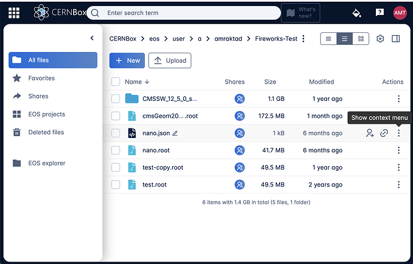
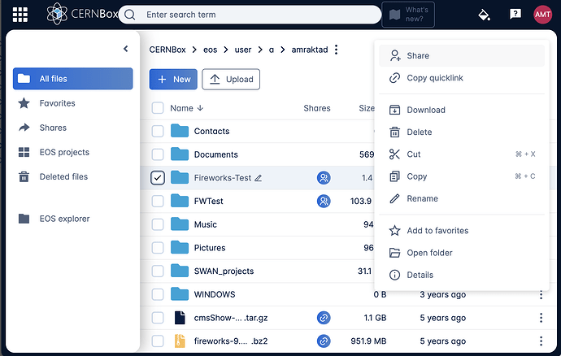

## Makeing data visiblie to the CMS web visualization service
Login to CERNBox and select a folder to share. Choose the vertical triple dot icon to access context menu

Select 'Share' action from the context popup menu

Make the folder sharable with cms-vis-access group.

